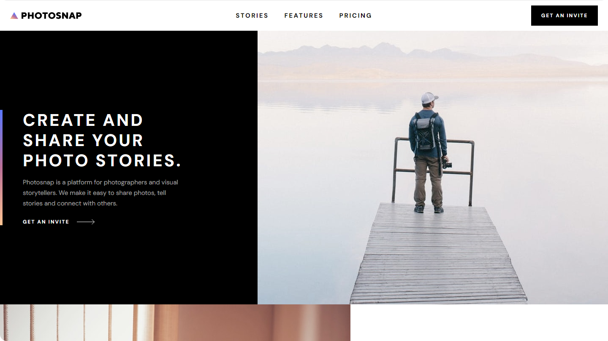

# Frontend Mentor - Photosnap Website solution

This is a solution to the [Photosnap Website challenge on Frontend Mentor](https://www.frontendmentor.io/challenges/photosnap-multipage-website-nMDSrNmNW). Frontend Mentor challenges help you improve your coding skills by building realistic projects.

## Table of contents

- [Overview](#overview)
  - [The challenge](#the-challenge)
  - [Screenshot](#screenshot)
  - [Links](#links)
- [My process](#my-process)
  - [Built with](#built-with)
  - [What I learned](#what-i-learned)
  - [Continued development](#continued-development)
- [Author](#author)

## Overview

### The challenge

Users should be able to:

- View the optimal layout for each page depending on their device's screen size
- See hover states for all interactive elements throughout the site

### Screenshot

### Links

- Solution URL: [GitHub Repo](https://github.com/ryanbradley-webdev/photosnap)
- Live Site URL: [Hosted on Netlify](https://photosnap-rbwd.netlify.app/)

## My process

### Built with

- [React](https://reactjs.org/) - JS library
- [React-Router](https://reactjs.org/) - React add-on for URL routing

### What I learned

This project proved challenging in some surprising areas. Specifically, the hover states for social media icons proved especially challenging. Incorporating the gradient background of each svg required some heavy iteration. The solution I arrived at was to nest a copy of the svg within the element with a white fill and positioning it absolute. Then, when the element is hovered or focused, the opacity of this copy is set to zero, showing the original gradient image.

### Continued development

Image optimization is an important part of my front-end development. In the future I plan to improve my methods for optimizing images ahead of time and implementing more 'img' elements utilizing the 'srcSet' property instead of setting the display to 'none' for images I don't want shown.

## Author

- Visit my portfolio - [ryanbradleyportfolio.com](https://ryanbradleyportfolio.com)
- Contact me for your next website - [ryanbradleywebdev.com](https://ryanbradleywebdev.com)
- Email me - [ryan@ryanbradleywebdev.com](ryan@ryanbradleywebdev.com)
- Follow my Instagram - [@ryanbradley_web_dev](https://www.instagram.com/ryanbradley_web_dev/)